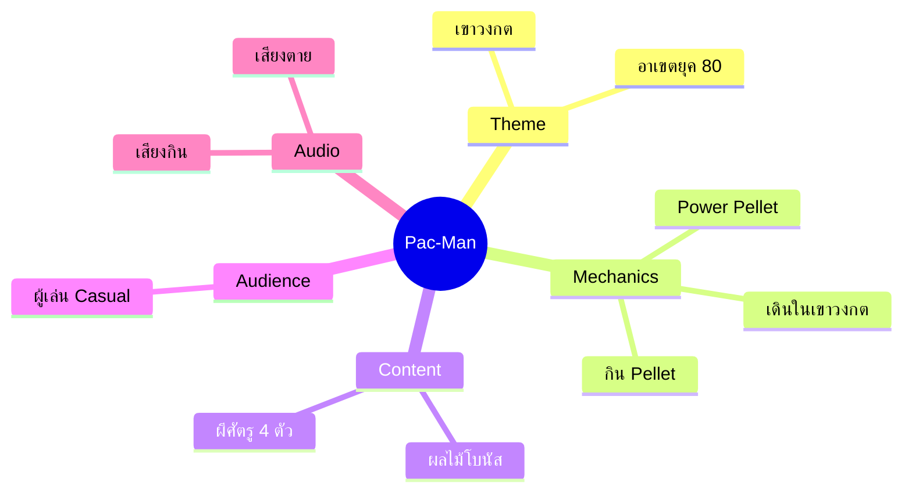
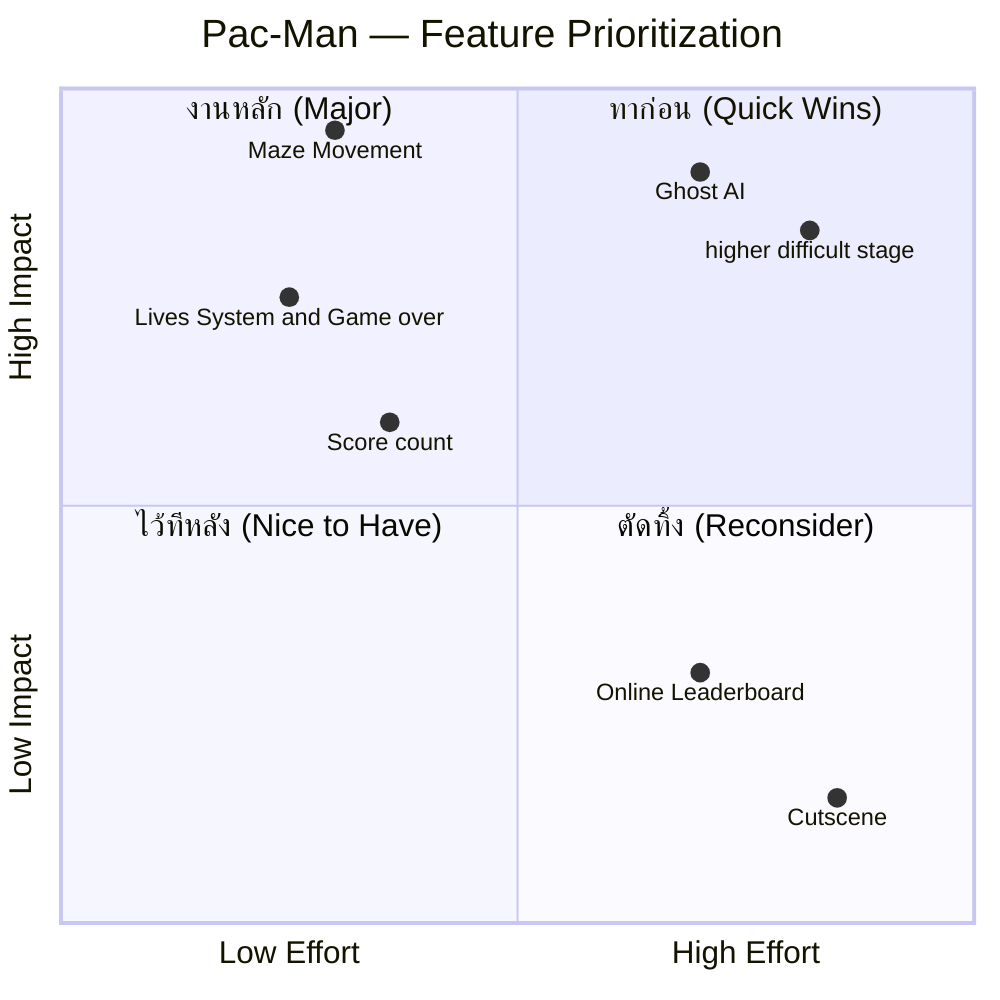
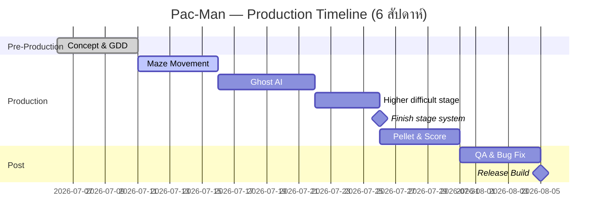

```mermaid
mindmap
  root((Pac-Man))
    Theme
      เขาวงกต
      อาเขตยุค 80
    Mechanics
      เดินในเขาวงกต
      กิน Pellet
      Power Pellet
    Content
      ผีศัตรู 4 ตัว
      ผลไม้โบนัส
    Audience
      ผู้เล่น Casual
    Audio
      เสียงกิน
      เสียงตาย

```

```mermaid
quadrantChart
  title Pac-Man — Feature Prioritization
  x-axis "Low Effort" --> "High Effort"
  y-axis "Low Impact" --> "High Impact"
  quadrant-1 "ทาก่อน (Quick Wins)"
  quadrant-2 "งานหลัก (Major)"
  quadrant-3 "ไว้ทีหลัง (Nice to Have)"
  quadrant-4 "ตัดทิ้ง (Reconsider)"
  Maze Movement: [0.3, 0.95]
  Ghost AI: [0.7, 0.9]
  Online Leaderboard: [0.7, 0.3]
  Lives System and Game over: [0.25, 0.75]
  Score count:[0.36, 0.6]
  Cutscene:[0.85,0.15]
  higher difficult stage:[0.82,0.83]
```

Comment:ระบบเพิ่มความยากเมื่อผ่านด่านทำให้ให้ผู้เล่นรุ้สึกท้าทายมากขึ้น แต่ระบบ CutScene ไม่ค่อยจำเป็น

```mermaid
gantt
title Pac-Man — Production Timeline (6 สัปดาห์)
dateFormat YYYY-MM-DD
section Pre-Production
Concept & GDD :done, c1, 2026-07-06, 5d
section Production
Maze Movement :active, p1, after c1, 5d
Ghost AI : p2, after p1, 6d
Higher difficult stage : p3, after p2, 4d
Finish stage system  :milestone, m1, after p3, 0d
Pellet & Score : p4, after p3, 5d
section Post
QA & Bug Fix :  q1, after p4, 5d
Release Build :milestone, m1, after q1, 0d
```
